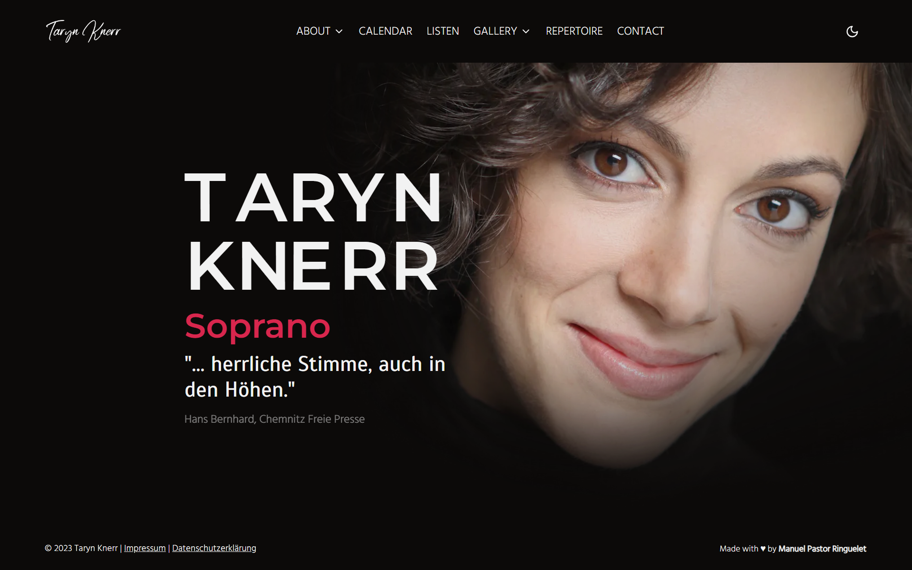

# Opera Singer Website

This is a website for an opera singer, showcasing their talent, performances, and biography. The website is built using Next.js, Tailwind CSS, Sanity, and Shadcn.



## Technologies Used

- **Next.js**: The website is developed using Next.js, a React framework for building server-rendered React applications.

- **Tailwind CSS**: Tailwind CSS is used for styling, providing a utility-first approach for rapid UI development.

- **Sanity**: Sanity is used as a headless CMS (Content Management System) to manage the singer's content, including performances, biography, and media.

- **Shadcn**: Shadcn is used for optimizing and delivering high-quality images for a better user experience.

## Getting Started

Follow these steps to run the website locally:

1. **Clone the Repository**

   ```bash
   git clone https://github.com/your-username/opera-singer-website.git
   ```

   Replace `your-username` with your GitHub username.

2. **Navigate to the Project Directory**

   ```bash
   cd opera-singer-website
   ```

3. **Install Dependencies**

   ```bash
   npm install
   ```

4. **Set Up Sanity**

   - Configure your Sanity project and provide the necessary environment variables.

5. **Start the Development Server**

   ```bash
   npm run dev
   ```

6. **Open in Your Browser**

   Open your web browser and visit [http://localhost:3000](http://localhost:3000) to view the website.

## Features

- Showcase opera performances.
- Display the singer's biography and achievements.
- Manage content easily using Sanity CMS.
- Optimized image delivery for faster loading.

## Deployment

Deploy the website to your preferred hosting platform, such as Vercel, Netlify, or a custom server.

## Contributors

- [Your Name](https://github.com/manuelpastorringuelet)

## License

This project is licensed under the MIT License.

